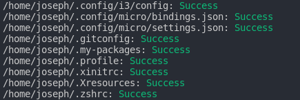
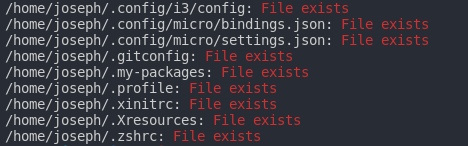

# My dotfiles 😎🖖

## Setup

- arch-linux
- i3-gaps
- i3-blocks
- zsh
- oh-my-zsh
- alacritty terminal
- micro-editor

## How to use

copy files or execute `install.sh` script:

```
-------------------------------------------------
                Jsi1v4 - dotfiles - install
-------------------------------------------------
  commands:
    --help,  -h -> show this help;
    --force, -f -> overwrite the files, if exists;
-------------------------------------------------
```

output on success:



output on error:


